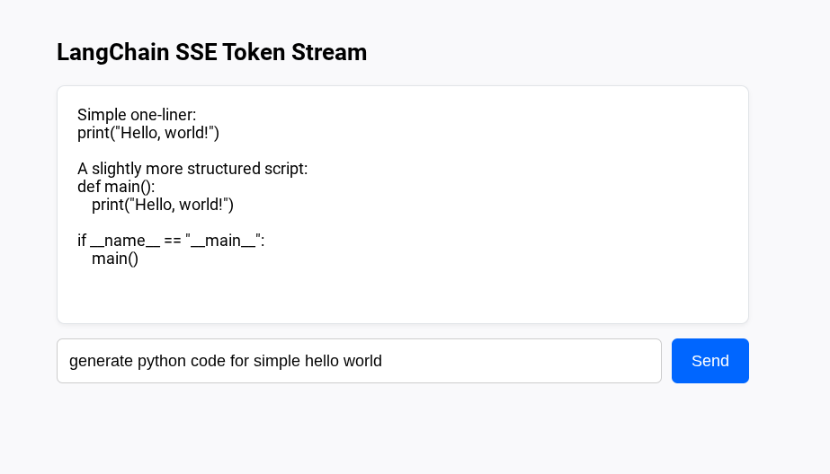

# A Streaming QnA Application

### Project Architecture

1. **`app.py`**: A FastAPI backend using `langchain_openai` and standard Python generators to stream SSE events.
2. **`index.html`**: A lightweight client using the web browser's native `EventSource` API to consume and render tokens in real time.


### Step 1: Install Prerequisites

In your terminal, install the required packages:

```bash
pip install langchain langchain-openai fastapi uvicorn python-dotenv

```

Ensure your API key is set in your environment or a `.env` file:

```env
OPENAI_API_KEY=your-actual-openai-api-key
```
Ensure the AI Model is just the model name
```env
AI_MODEL=gpt-5-mini
```
### Step 2: Backend (`app.py`)

We use LangChain's `.astream()` method to yield model chunks incrementally into FastAPI's `StreamingResponse`.


### Step 3: Frontend (`index.html`)

It uses browser-native `EventSource` to open an SSE stream and append text dynamically as it streams in.

### Step 4: Run & Test the App

1. Launch the application:
```bash
python app.py
```

2. Open `[http://127.0.0.1:8000](http://127.0.0.1:8000)` in your web browser.
3. Type a prompt (e.g., *"Explain quantum computing in simple terms"* or *"Write a 3-paragraph story"*) and hit **Send**. You will watch the LLM output display character-by-character in real time.

### How it Works Under the Hood

| Core Mechanism | Description |
| --- | --- |
| **`chain.astream(...)`** | LangChain async iterator yielding generated text tokens (`AIMessageChunk`) as soon as the provider emits them. |
| **`StreamingResponse`** | FastAPI wrapper that streams chunk payloads without holding the HTTP response buffer open until complete. |
| **`text/event-stream`** | Standard HTTP Server-Sent Events header allowing persistent single-direction real-time stream streaming. |
| **`EventSource` API** | Built-in browser web API handling reconnects, chunk assembly, and live text rendering seamlessly. |

### Output

